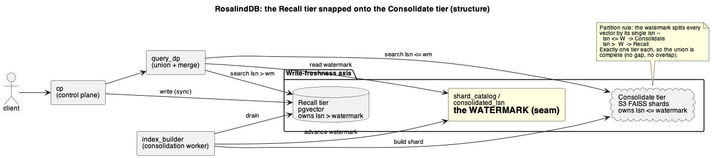

<div align="center">


# RosalindDB

**Object-storage-native vector database with read-your-writes.**

[](https://opensource.org/licenses/Apache-2.0)
[](https://www.python.org/downloads/)
[](#quickstart)
[](docs/deploy/self-host.md)

</div>

---

## Overview

RosalindDB keeps its index where your data already lives — on object storage — and serves nearest-neighbour search out of a byte-budgeted in-process cache, with no always-on cluster to pay for. It stores immutable FAISS IVFFlat shards on any S3-compatible store (AWS S3, MinIO, R2, GCS) and runs heavy work — validate, build, cold queries — on queue-driven workers that scale to zero. The steady-state footprint is small; cost tracks what you actually query, not how big the corpus is.

What sets it apart is **strong read-your-writes**. An optional **recall tier** — a separate pgvector instance — accepts synchronous, durable upserts that are immediately queryable, while the cold **consolidate tier** holds the FAISS shards on S3. At query time the two are unioned LSM-style: the recall tier is the hot memtable, the S3 shards are the SSTables, and a per-partition `consolidated_lsn` watermark partitions every vector into exactly one tier so the union is complete and recent writes win. A background consolidation worker periodically folds the recall tier down into shards (optionally via an LSM delta tier for incremental compaction). The recall tier is gated behind `RB_RECALL` and is **off by default** — without it RosalindDB is a pure cold-shard engine; with it you get write-then-read consistency, which is what agent long-term memory and freshly-mutated RAG corpora actually need. See [`docs/architecture/recall-consolidate.md`](docs/architecture/recall-consolidate.md) and the [tandem](docs/architecture/diagrams/recall-consolidate-tandem.png) / [lifecycle](docs/architecture/diagrams/recall-consolidate-lifecycle.png) diagrams.

RosalindDB is built to be self-hosted. The whole system is **one image running five process roles** (control plane, query data plane, validator, index builder, ephemeral runner) over Postgres, Redis, an object store, and — when recall is on — a dedicated pgvector instance; a single `docker compose up` brings it all up on safe defaults. **Auth is off by default** (OSS mode: every request resolves to a built-in `default` tenant), and flipping `RB_REQUIRE_AUTH=true` plus a real `JWT_SECRET` turns the same image into a multi-tenant deployment with JWT login and `rb_live_…` API keys. It is Apache-2.0 licensed.

**Built for:** agent long-term memory, indie or early-stage RAG over slowly-changing (or freshly-mutated, with recall on) corpora, batch retrieval, internal-tool search, cost-sensitive similarity lookups where always-on cluster pricing is the wrong shape.

**Not built for:** sub-10ms p50 interactive search at scale, billion-vector multi-tenant production on a single node, or a drop-in replacement for a tuned hot-tier in-memory cluster.

## Features

- **Object-storage-native** — immutable FAISS IVFFlat shards live on any S3-compatible store; no always-on cluster, cost tracks queries not corpus size.
- **Strong read-your-writes** — optional pgvector recall tier accepts synchronous, durable, immediately-queryable upserts (gated by `RB_RECALL_DSN`, off by default).
- **LSM tiering** — hot recall tier unioned with cold S3 shards on a `consolidated_lsn` watermark; background consolidation folds hot → cold, with an optional delta tier (`RB_DELTA_TIER`) for incremental compaction.
- **One image, five roles** — control plane, query data plane, validator, index builder, ephemeral runner all run from a single Dockerfile via `command:` overrides.
- **Scale-to-zero workers** — validate / build / cold-query run on a Redis-backed reliable queue with DLQ + reaper; idle workers drain and scale down.
- **Vector management API** — create / list / get / delete datasets and vectors over `/v1/*`, with tombstones and filtered pagination.
- **Auth & quotas, both opt-in** — `RB_REQUIRE_AUTH` adds JWT + `rb_live_…` API keys + per-tenant isolation; `RB_ENABLE_QUOTAS` adds rate limiting + ingest/query quotas. Off by default for frictionless local use.
- **OpenTelemetry throughout** — vendor-neutral OTLP traces, metrics, and logs; fail-soft, fully no-op-able via `OTEL_SDK_DISABLED`.
- **Self-host first** — one `docker compose up` on safe defaults; the same image runs multi-tenant SaaS via two env switches.

## Architecture

RosalindDB is tiered along two orthogonal axes — and the only one that affects correctness is **write freshness**.

> Two axes, never conflated ([`docs/architecture/recall-consolidate.md`](docs/architecture/recall-consolidate.md) §"Two axes"):
> - **Storage distance** — object store → SSD → RAM. A pure cache concern; a miss is slower, never wrong. See [`docs/architecture/ssd-cache.md`](docs/architecture/ssd-cache.md), [`docs/architecture/mmap.md`](docs/architecture/mmap.md).
> - **Write freshness** — **recall** (hot) ↔ **consolidated** (cold). Partitioned by the `consolidated_lsn` watermark. This is the seam below.

### The two tiers

**Consolidated (cold) — always on.** Immutable FAISS **IVFFlat** shards on S3, each paired with a `{shard_uri}.meta.json` sidecar that maps every SHA1→int64 FAISS id back to `{id, metadata}`. This is the default path and is served regardless of any flag.

**Recall (hot) — `RB_RECALL_DSN`, default off.** A *separate* pgvector data-plane instance (not the control-plane Postgres — blast-radius isolation; compose runs it on host port `5433`, idle until enabled). A synchronous `UPSERT` is durable and immediately queryable. Recall search is **brute-force exact L2** scoped to the `(tenant, dataset)` partition, computed as `power(embedding <-> q, 2)` so pgvector L2 aligns to FAISS L2² before the merge. Schema: `src/adapters/state/migrations/recall/001_recall_vectors.sql`.

```
read query
   │
   ├─────────────► recall scan (pgvector, exact L2²)        lsn >  consolidated_lsn
   │                  │      (concurrent, bounded executor)
   └─────────────► consolidated FAISS search (IVFFlat)      lsn <= consolidated_lsn
                      │
                      ▼
               merge: recall authoritative above watermark, recall-wins dedup,
               tombstone + filtered-out suppression, sort asc by L2², truncate top_k
                      │
                      ▼   wall-time ≈ max(recall, consolidated), not sum
                  matches[]
```

**The watermark is the seam.** `consolidated_lsn` is a column on `shard_catalog` (`src/adapters/state/migrations/008_shard_consolidated_lsn.sql`), advanced only at consolidation. Every vector carries exactly one LSN, so the partition `lsn <= consolidated_lsn` (cold) vs `lsn > consolidated_lsn` (hot) is a complete, non-overlapping cover — the union is always exactly the dataset. The read union lives in `src/services/query_api/v1_query.py`: `_resolve_shard` resolves the newest shard once, `_search_consolidated_shard` runs inline while `recall_search` runs on the bounded `_RECALL_EXECUTOR` (`RB_RECALL_OVERLAP_WORKERS`, default 32), then `_merge_recall_and_consolidated` combines them.

### Consolidation (recall → cold)

`run_consolidate_once` / `_run_consolidate_locked` (`src/services/index_builder/run.py`): snapshot → fold live recall rows and apply tombstones → commit `consolidated_lsn = N` → grace-bounded, idempotent trim of consolidated recall rows. Triggers: the per-tenant cap `RB_RECALL_MAX_ROWS` (default 2000, enqueued from `post_vectors`) and consolidate-on-idle `RB_RECALL_IDLE_S` (default 60; the builder idle-tick sweep drains to zero and scales down). A per-dataset Postgres advisory lock serialises builds.

### Delta-tier LSM (`RB_DELTA_TIER`, default off)

When the cold tier itself is large, full rebuilds get expensive — so consolidated shards become an LSM (`src/adapters/state/migrations/009_delta_tier.sql`):

- A **generation** = one **base** shard (level 0, bare `IndexIVFFlat`, native ids) + up to `RB_MAX_DELTAS` (default 8) **delta** shards (level 1) that share one frozen coarse quantizer.
- **Minor fold** — each consolidation appends a delta, cost `O(new rows)`.
- **Major compaction** — at the `RB_MAX_DELTAS` cap, `_maybe_major_compaction` → `_major_compaction` rewrites the generation synchronously under the per-dataset lock. Hard backstop: `RB_MAX_DELTAS_HARD` (default 16).
- The read union resolves the live generation from one snapshot (`_state._generations`); its watermark is the **contiguous-MIN frontier** (`_frontier_watermark`, gap-clamped — never `max()`), with newest-delta-wins dedup and per-delta `tombstone_int_ids` suppression. `keep=2` generations for grace.
- Validated to 1M vectors (SIFT, dim-128): recall occupancy and query p50 stay flat across compaction.

### Five process roles, one image

A single `Dockerfile` (`python:3.11-slim`, non-root uid 10001, `pip install -e . --no-deps`); each service in `docker-compose.yml` selects its role via a `command:` override. See [`docs/architecture/architecture.md`](docs/architecture/architecture.md) §"The five service roles".

| Role | Module / command | Public? |
|---|---|---|
| Control Plane | `services.control_plane.cp_app:app` (uvicorn) | **yes** — `:8080`, the only host port |
| Query Data Plane | `services.query_api.dp_app:app` (uvicorn) | no |
| validator_worker | `python -m services.validator_worker.run` | no |
| index_builder | `python -m services.index_builder.run` (also runs the queue reaper) | no |
| ephemeral_runner | `python -m services.ephemeral_runner.run` | no |

The Control Plane is the single public origin. It reuses the internal `source_registry` FastAPI app (auth, datasets, ingest, imports, CORS, request-scoped connections) and mounts `query_proxy.router`, which reverse-proxies `/v1/query` to the private Query DP with a trusted `X-RB-Tenant-Id` header. "Source Registry" is an internal module name, not a separate role.

**Infra services** (compose): `redis` (reliable queue + ephemeral result store + rate-limit coordination), `minio` (S3) + a one-shot `createbuckets`, `postgres` (control-plane catalog), `pgvector` (recall data plane, separate instance, `:5433`, idle unless `RB_RECALL_DSN` is set), and a one-shot `migrator` (`python -m scripts.migrate`; waits for Postgres, conditionally for recall). The Redis reliable-queue contract — `LPUSH` / `LMOVE`-to-processing / `LREM`-ack, nack-with-retry, DLQ at `QUEUE_MAX_ATTEMPTS=5`, reaper at `QUEUE_RECLAIM_TIMEOUT=300s` — carries topics `VALIDATE_DATASET`, `DATASET_READY`, `RUN_EPHEMERAL_QUERY`, `RESULT_READY`, `DELETE_VECTORS`, and `CONSOLIDATE`.

### Write path

```
POST /v1/datasets/{name}/vectors
        │
   ┌────┴─────────────────────────────────────────────┐
   │ RB_RECALL off (default)        │ RB_RECALL on     │
   │ async / cold-build             │ read-your-writes │
   ▼                                ▼
 land JSONL to S3                 synchronous pgvector UPSERT
 enqueue VALIDATE_DATASET         → durable, immediately queryable
        │                          → 200 (no job_id)
 validator → parquet              → enqueue CONSOLIDATE on RB_RECALL_MAX_ROWS
 enqueue DATASET_READY                    │
        │                          consolidation folds recall → shard,
 index_builder builds IVFFlat            advances consolidated_lsn
 shard → S3 (+ .meta.json)               (delta minor-fold / major
        │                                 compaction when RB_DELTA_TIER on)
   202 (job_id)
```

> The recall, delta, and SSD/mmap tiers are **implemented but flag-gated and off by default** (`RB_RECALL_DSN`, `RB_RECALL`, `RB_DELTA_TIER`, `RB_SHARD_TIER_BYTES`, `RB_FAISS_MMAP`). A fresh `docker compose up` runs the always-on cold path only.

## Quickstart

RosalindDB runs as five process roles from a single image — Control Plane (CP), Query Data Plane, validator, index builder, and ephemeral runner — backed by Postgres, Redis, and an S3-compatible store. The bundled `docker compose` stack wires all of this up and exposes a **single public origin: the Control Plane at `http://localhost:8080`**. Every client request goes through the CP; the other services stay private to the compose network.

<p align="center">
  
</p>

### Prerequisites

- **Docker** (with `docker compose`) — the only hard requirement for a local run. The integration tests additionally use the Docker daemon via testcontainers.

### 1. Bring up the stack

```bash
# Clone the repo:
git clone https://github.com/rosalinddb/rosalinddb.git
cd rosalinddb

# Build the image and start everything detached:
make run-local
# equivalent to:  make build  &&  docker compose up -d

# Or directly:
docker compose up -d --build
```

This starts `redis`, `minio` (S3 at `:9000`, console at `:9001`), `postgres` (`:5432`), the one-shot `createbuckets` + `migrator`, then the app services. **Only the CP publishes a host port (`8080`).** The `pgvector` recall-tier container (`:5433`) comes up healthy but stays idle unless you enable the recall tier (`RB_RECALL_DSN`).

> Dev defaults (`postgres/postgres`, `minio/minio123`, `JWT_SECRET=dev-secret`, auth **off**) are for localhost only. Override them before exposing the deployment.

### 2. Wait for the CP to be healthy

```bash
# Liveness probe (unauthenticated):
curl http://localhost:8080/healthz
# -> {"status": "ok", "service": "control_plane"}

# Or poll until ready:
until curl -fsS http://localhost:8080/healthz >/dev/null 2>&1; do sleep 1; done
echo "CP ready"
```

### 3. Run the smoke check

```bash
make smoke
# runs:  python scripts/smoke.py --base-url http://localhost:8080
```

`make smoke` walks the full happy path (health → dataset → ingest → index → query) and exits non-zero on the first failing step, so it drops straight into a CI/deploy gate. The script is stdlib-only (no venv needed) and auto-detects whether auth is on or off. Point it at a deployed instance with `make smoke BASE_URL=https://api.example.com`.

### 4. Minimal end-to-end flow (curl)

By default (`RB_REQUIRE_AUTH=false`) the API is **open** — every request resolves to the built-in `default` tenant and no auth header is needed.

```bash
BASE=http://localhost:8080

# 1. Create a dataset (dimension must match your vectors).
curl -s -X POST "$BASE/v1/datasets" \
  -H 'Content-Type: application/json' \
  -d '{"name":"demo","dimension":4}'
# -> 201

# 2. Ingest vectors as NDJSON (one JSON object per line).
printf '%s\n' \
  '{"id":"vec-0","values":[0,1,2,3],"metadata":{"n":0}}' \
  '{"id":"vec-1","values":[1,2,3,4],"metadata":{"n":1}}' \
| curl -s -X POST "$BASE/v1/datasets/demo/vectors" \
  -H 'Content-Type: application/x-ndjson' --data-binary @-
# -> 202 {"accepted": 2, ...}    (validate -> index pipeline runs async)

# 3. Wait for indexing — poll the dataset until status is "indexed".
curl -s "$BASE/v1/datasets/demo"
# -> {"name":"demo","status":"indexed", ...}

# 4. Query for nearest neighbours.
curl -s -X POST "$BASE/v1/query" \
  -H 'Content-Type: application/json' \
  -d '{"dataset":"demo","vector":[0,1,2,3],"top_k":5}'
# -> 200 {"matches":[{"id":"vec-0","score":0.0,"metadata":{"n":0}}, ...], "mode":"hot"}
```

`score` is the raw FAISS **L2 distance** (lower is closer). `mode` reflects how the query was served: `hot`/`cold` (consolidated shard, cached or not), `recall` (answered from the hot recall tier), or `ephemeral`. If a shard isn't cached yet you may get an `ephemeral` response with a `job_id`:

```bash
# -> 202 {"mode":"ephemeral", "job_id":"job_..."}
curl -s "$BASE/v1/query/status/job_..."   # poll until ready
```

> **Auth-on deployments** (`RB_REQUIRE_AUTH=true`): first `POST /auth/signup` to get an `rb_live_...` API key, then add `-H "Authorization: Bearer rb_live_..."` to every `/v1/*` call. In default OSS mode the auth routes return `404 auth_disabled` — skip them.

> **Read-your-writes** is available behind the optional recall tier (`RB_RECALL_DSN`, default off). When enabled, ingest becomes a synchronous upsert (`200`, no `job_id`) and writes are immediately queryable. See [`docs/architecture/recall-consolidate.md`](docs/architecture/recall-consolidate.md) and the [lifecycle diagram](docs/architecture/diagrams/recall-consolidate-lifecycle.png).

For uploads above the 10 MiB request cap, use the async bulk-import flow in [`docs/api/imports.md`](docs/api/imports.md). The full REST contract — every endpoint, every error code — is in [`docs/api/v1.md`](docs/api/v1.md).

## Configuration

RosalindDB **runs on defaults — set only what points at your infra.** A fresh `docker compose up` boots the full stack with no `.env` at all: every feature flag is off by default and every other variable has a safe default. Configuration is read once at startup from environment variables; the single source of truth is [`src/adapters/config.py`](src/adapters/config.py), which snapshots the whole env surface into a frozen `CONFIG` object.

The variables below are the ones that actually matter — the ones that point RosalindDB at *your* storage, database, and identity.

### Storage (S3 / object store)

| Var | Default | What it does |
|---|---|---|
| `S3_ENDPOINT_URL` | _unset → AWS S3_ | S3-compatible endpoint (MinIO, R2, GCS…). Leave unset to hit real AWS. |
| `S3_ACCESS_KEY` | _unset_ | Object-store access key. |
| `S3_SECRET_KEY` | _unset_ | Object-store secret key. |
| `S3_REGION` | `us-east-1` | Bucket region. |
| `INDEXES_PREFIX` | `s3://rosalinddb/indexes` | Where FAISS index shards are written and read. |
| `LANDING_PREFIX` | `s3://rosalinddb/landing` | Where ingested data lands before it is indexed. |

### Catalog (Postgres)

| Var | Default | What it does |
|---|---|---|
| `DATABASE_URL` | `memory://local` | Control-plane catalog DSN. **Point this at Postgres (`postgresql://…`) for any real deploy** — the default is in-process and non-durable. |

### Recall / Consolidate tier — read-your-writes (default OFF)

| Var | Default | What it does |
|---|---|---|
| `RB_RECALL_DSN` | _empty → off_ | DSN of the **separate pgvector recall instance** (its own data plane, not the catalog Postgres). Blank = recall tier off, no connection opened. Set it to turn on synchronous, immediately-queryable upserts and the recall+consolidated query union. |
| `RB_RECALL` | `false` | Enables the consolidation worker that drains the recall hot tier into cold FAISS shards. |
| `RB_DELTA_TIER` | `false` | Enables the delta-tier (LSM) query path — recent writes overlaid on consolidated shards instead of a full rebuild. |

### Auth

| Var | Default | What it does |
|---|---|---|
| `RB_REQUIRE_AUTH` | `false` | Off = the API is **open** and every request resolves to the built-in `default` tenant (loud startup banner warns against public exposure). **Set `true` for any public deployment.** |
| `JWT_SECRET` | `dev-secret` (compose) | JWT signing secret. When `RB_REQUIRE_AUTH=true`, `validate()` errors at boot if it is unset — without it, tokens fall back to an ephemeral per-process secret and break on restart. Generate a stable one with `openssl rand -hex 32`. |

> **The tuning-knob tail** — pool sizing (`RB_RECALL_POOL_MAX`, `RB_PG_POOL_MAX`), query/index params (`RB_QUERY_NPROBE`, `IVF_NLIST`), recall lifecycle (`RB_RECALL_MAX_ROWS`, `RB_RECALL_IDLE_S`, `RB_RECALL_OVERLAP_WORKERS`), the SSD shard-cache tier (`RB_SHARD_TIER_BYTES`), quotas (`RB_ENABLE_QUOTAS`), `REDIS_URL`, and the `OTEL_*` exporters — all ship with safe defaults. [`src/adapters/config.py`](src/adapters/config.py) is the complete, typed source of truth. See [`.env.example`](.env.example) for an annotated starting point.

## Production notes

A short, opinionated list — the things that bite real self-hosters.

- **PgBouncer in transaction-pooling mode breaks advisory locks.** The migrator and the per-dataset builder lock both rely on session-level PostgreSQL advisory locks; transaction pooling releases the lock between statements, which deadlocks migrations and lets two builders race the same dataset. Use **session** pooling, or skip PgBouncer for the catalog connection. (The recall pgvector instance, which holds no session locks, is fine behind transaction pooling.)
- **The FAISS shard cache is ephemeral by design.** It lives in the container filesystem, warms on the first cold query, and is gone on `docker compose down` — there is no volume to persist. Re-warming takes seconds and sidesteps stale-cache hazards on shard rebuilds.
- **JWTs are HS256 with a 24h TTL** and there is no refresh-token flow yet — server-to-server callers should mint `rb_live_…` API keys instead.
- **API keys are SHA-256 hashed at rest.** The raw value is surfaced once on creation and never again — store it like a password.

More gotchas in [`docs/deploy/self-host.md`](docs/deploy/self-host.md).

## API summary

Everything is served from the Control Plane on `:8080`. Full reference under [`docs/api/`](docs/api/) ([`v1.md`](docs/api/v1.md), [`query.md`](docs/api/query.md), [`vectors.md`](docs/api/vectors.md), [`ingest.md`](docs/api/ingest.md), [`imports.md`](docs/api/imports.md), [`auth.md`](docs/api/auth.md), [`quotas.md`](docs/api/quotas.md)).

| Method | Path | Purpose |
|---|---|---|
| `GET` | `/healthz` | Unauthenticated liveness probe |
| `POST` | `/auth/signup` · `/auth/login` | Create tenant / get a JWT (`404 auth_disabled` when auth off) |
| `POST` | `/v1/datasets` | Create a dataset (`{name, dimension}`) |
| `GET` | `/v1/datasets` · `/v1/datasets/{name}` | List / get a dataset (poll for `status:indexed`) |
| `DELETE` | `/v1/datasets/{name}` | Soft-delete a dataset (`204`) |
| `POST` | `/v1/datasets/{name}/vectors` | Ingest vectors (NDJSON, 10 MiB cap; `202` async / `200` recall) |
| `GET` | `/v1/datasets/{name}/vectors` | List vectors (filter + pagination cursor) |
| `GET`/`DELETE` | `/v1/datasets/{name}/vectors/{id}` | Fetch / delete a single vector (`?include_values`; delete = `202` job / `204` recall-tombstone) |
| `POST` | `/v1/datasets/{name}/imports` | Bulk import via presigned upload (5 GiB cap) + complete/status |
| `POST` | `/v1/query` | Nearest-neighbour query — `{vector, top_k, nprobe, filter}` → `{matches, latency_ms, mode}` |
| `GET` | `/v1/query/status/{job_id}` | Poll an async (`ephemeral`) query result |

Queries return `score` as raw FAISS L2 distance (lower is closer); `filter` is a flat AND-of-equals over metadata. `mode` ∈ `hot | cold | recall | ephemeral`.

## MCP server

A companion **Model Context Protocol** server lets you operate RosalindDB from any MCP client (Claude Desktop, Cursor, Claude Code) — datasets, ingest, and query exposed as MCP tools. It lives in a separate repo: [rosalinddb/rosalinddb-mcp](https://github.com/rosalinddb/rosalinddb-mcp).

## Development & testing

RosalindDB is a real installable Python package, not a folder of scripts. It uses a **src-layout** ([`pyproject.toml`](pyproject.toml): `package-dir = {"" = "src"}`) and is installed editable with `pip install -e .`, so imports are `services.*` / `adapters.*` everywhere — **no `sys.path` shims, no `PYTHONPATH` tricks**. The same install backs the tests, the CLI scripts, and the Docker image. Python 3.11 is the supported runtime (binary wheels for `faiss-cpu`, `pyarrow`, `psycopg2-binary`).

```bash
make venv          # python -m venv .venv && pip install -e .
# or, by hand:
python3.11 -m venv .venv && source .venv/bin/activate && pip install -e .
```

### Make targets

| Target | What it does |
|---|---|
| `make build` | Build the single `rosalinddb-backend:latest` image every service runs from |
| `make run-local` | `build` + `docker compose up -d` |
| `make venv` | Create `.venv` and `pip install -e .` |
| `make test-unit` | `pytest -m unit` — fast, hermetic, **no Docker** |
| `make test-integration` | `pytest -m integration` — real MinIO via testcontainers (**Docker required**) |
| `make test` | both suites |
| `make smoke` | `scripts/smoke.py` happy-path check against an already-running stack (`BASE_URL=http://localhost:8080`) |
| `make fmt` | `ruff format .` |
| `make lint` | `ruff check .` |

### Two-tier test suite

Markers are applied **automatically by directory** in [`tests/conftest.py`](tests/conftest.py) (`tests/unit` → `unit`, `tests/integration` → `integration`), so `-m unit` / `-m integration` select the tier without per-file decoration.

- **Unit** (`tests/unit/`) — zero filesystem and zero network I/O; storage goes through the `memory://` adapter. Runs anywhere, no Docker.
- **Integration** (`tests/integration/`) — spins up an ephemeral MinIO container per session via testcontainers, plus a real Postgres for the catalog.

Integration tests run against real MinIO and real Postgres because the seams we care about — multipart uploads, presigned URLs, advisory locks, transaction semantics — are exactly the parts a fake gets wrong. Fakes get fakey. If a behavior only works against the fake, it doesn't work.

See [`CONTRIBUTING.md`](CONTRIBUTING.md) for the patch workflow. The short version: `pip install -e .`, keep `make fmt && make lint && make test-unit` green, and run `make test-integration` (Docker) before opening a PR. Vulnerability reports go in [`SECURITY.md`](SECURITY.md).

## Project layout

```
src/
  services/      # the 5 process roles: control_plane, query_api, validator_worker,
                 #   index_builder, ephemeral_runner (+ auth, source_registry, _common)
  adapters/      # infra seams: storage (S3), state (Postgres), recall (pgvector),
                 #   queue (Redis), cache, observability, config.py  (← single env surface)
  schemas/       # request/response models (e.g. src/schemas/v1.py)
tests/
  unit/          # hermetic — memory:// adapters, no network, no Docker
  integration/   # end-to-end against a real MinIO container (testcontainers)
docs/            # architecture/, api/, deploy/, indexing.md
```

`bench/` (private scale/chaos harness) is intentionally **not** part of the public build or test surface.

## License & links

Apache 2.0 — see [`LICENSE`](LICENSE).

- **Deployment:** [`docs/deploy/self-host.md`](docs/deploy/self-host.md)
- **Architecture deep-dives:** [`docs/architecture/architecture.md`](docs/architecture/architecture.md), [`recall-consolidate.md`](docs/architecture/recall-consolidate.md), [`ssd-cache.md`](docs/architecture/ssd-cache.md), [`mmap.md`](docs/architecture/mmap.md), [`indexing.md`](docs/indexing.md)
- **Diagrams (PlantUML sources + rendered PNGs):** [`docs/architecture/diagrams/`](docs/architecture/diagrams/)
- **API reference:** [`docs/api/`](docs/api/)
- **Security:** [`SECURITY.md`](SECURITY.md)
