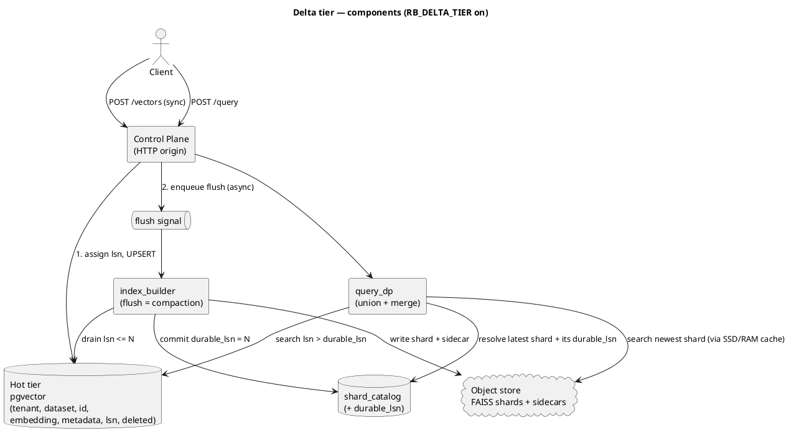
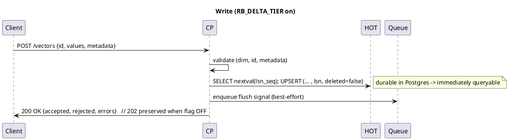
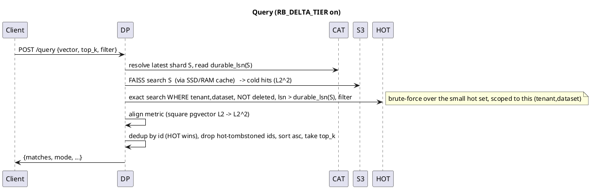

# Delta tier: read-your-writes on object storage

> **Status: DRAFT / not yet implemented.** Design under active iteration.
> The delta tier ships behind `RB_DELTA_TIER` (default **off**); a self-hoster who
> upgrades and changes nothing sees identical behaviour to today (same convention as
> [`ssd-cache.md`](ssd-cache.md)). Pairs with [`indexing.md`](indexing.md) (the build
> path the flush reuses), [`ssd-cache.md`](ssd-cache.md) (the read-cache hierarchy this
> sits *beside*, not inside), and [`architecture.md`](architecture.md).

## The problem

RosalindDB today is **eventually consistent on writes**: `POST /v1/datasets/{name}/vectors`
returns `202`, lands NDJSON, and a `DATASET_READY` build folds it into a FAISS shard
asynchronously. A query issued between the write and the build completing does **not**
see the new vector — it returns `ephemeral` (empty + `job_id`) or hits an older shard.

For batch RAG over slowly-changing corpora that is fine. For **agent memory it is not**:
an agent that stores "the user is allergic to peanuts" and asks "what should I avoid?"
on the next turn must get the fact back *now*. That property — **read-your-writes** — is
the table stakes the async pipeline cannot provide.

The delta tier adds a small, synchronously-writable, immediately-queryable **hot tier**
in front of the immutable shards, and unions the two at query time. It is the classic
**LSM-tree** split (memtable + SSTables) applied to an object-storage vector index — the
same shape Turbopuffer (WAL + object storage) and Pinecone serverless (a "freshness
layer") use.

## Two axes — do not conflate them

RosalindDB will have two things that both get called "tiers." They are orthogonal:

| Axis | Members | Purpose | Authority | Affects correctness? |
|---|---|---|---|---|
| **Storage distance** (today, see `ssd-cache.md`) | Object store → SSD → RAM | make *reaching cold data* fast | disposable copies; S3 is truth | **No** — a miss is only slower |
| **Write freshness** (this doc) | **hot (delta)** ↔ **cold (shards)** | make *just-written data* visible | hot is authoritative until flushed | **Yes** — the union must be complete |

The SSD/RAM cache holds **copies of cold shards**. It can never lose data — a miss just
re-fetches from S3. The delta tier holds **data that is in no shard yet**. The only place
completeness can break is the **hot↔cold seam** (§The watermark, §Invariants) — never the
cache.

## Architecture



The hot tier is **pgvector, deployed as a separate data-plane instance** (not the
control-plane Postgres — see §Blast radius). The flush is the **existing `index_builder`**
fed from pgvector rows instead of landing parquet. The watermark (`durable_lsn`) is the seam.

## Blast radius & control/data-plane isolation

The hot tier is **data-plane** work and MUST NOT share fate with the control-plane Postgres,
which is on the critical path of *every* query (the DP resolves tenant → dataset → latest
shard → `durable_lsn` from it). Today the vector *data* never touches the control-plane PG
(ingest goes S3 landing → builder → S3 shards); the hot tier must preserve that property.

Where the hot tier lives sets the blast radius of a write storm:

| Hot tier placement | A tenant write-storms → | Blast radius |
|---|---|---|
| Co-located on control-plane PG | metadata reads starve → no query can resolve its shard | **Total multi-tenant outage** |
| Separate shared hot instance (**default**) | co-tenants on that instance degrade; truth DB survives | degraded co-tenants, system up |
| Sharded / per-tenant hot (future) | only the noisy tenant degrades | noisy tenant only |

**Decision:** the hot tier defaults to a **separate pgvector instance** (data-plane),
addressed via `RB_HOT_DSN`. This mirrors RosalindDB's existing control-plane/data-plane split
(the CP already proxies `/v1/query` to a private Query DP). Per-tenant load is bounded by
quotas + the hot-row cap + flush, and the design stays shardable so blast radius can later
shrink to per-tenant.

**The CP is protected by construction:** the LSN sequence lives in the hot store, so the
per-write path never touches the control-plane PG. The control-plane PG sees the hot tier only
as a low-frequency `durable_lsn` update at flush time — never per write.

## The watermark (the seam)

Every write is stamped with a monotonic **`lsn`** (log sequence number) from a per-dataset
sequence. Each `shard_catalog` row gains **`durable_lsn`** = the highest LSN folded into
that shard. This single number partitions the universe of vectors:

```
   lsn <= durable_lsn   ->  lives in COLD  (the shard)
   lsn >  durable_lsn   ->  lives in HOT   (pgvector)
```

Every vector has exactly one LSN, so it is in **exactly one** set. Union = complete.
This is the whole correctness story; everything below protects this invariant.

The LSN sequence lives in the **hot store** (so the per-write path never touches the
control-plane PG); `durable_lsn` is written to the control-plane `shard_catalog` only at
flush. The two live in different databases by design (§Blast radius) — the flush's
commit-then-trim ordering (I2) plus an **idempotent trim** make that split safe without a
distributed transaction.

> **New to LSN / LSM / SSTable?** See the reading list in the design journal
> (kept out of this repo). Short version: an LSN is a monotonic version stamp on each
> write (like a Postgres WAL LSN or a RocksDB sequence number); an LSM-tree buffers writes
> in an in-memory *memtable*, then flushes them to immutable on-disk *SSTables*, merged by
> *compaction*. Here: pgvector = memtable, S3 shards = SSTables, `index_builder` = compaction.

## Write path



**Flush-cadence change.** Today every ingest batch produces a new shard. With the delta
tier, **writes no longer create shards** — they accumulate in pgvector and are baked into a
shard on **flush**, which coalesces many writes into one build. Net effect vs today:

| | Today | With delta tier |
|---|---|---|
| Shard created per | ingest batch | **flush** (batches many ingests) |
| Queryable when | after build | **immediately** (from hot) |
| Sidecar rewrites | per addition | per flush |

This *reduces* the write amplification `indexing.md` flags, and decouples shard-creation
rate from write rate.

**Delete / update.** Delete = `UPDATE … SET deleted=true` in hot (immediate tombstone).
Update = UPSERT (last-write-wins, new LSN). Tombstones are applied to cold at flush via the
existing `_remove_ids`.

**Bulk imports bypass hot.** The async import path (`POST …/imports`) lands directly to
cold (landing → builder → shard). Large dumps never enter the hot tier — this is what keeps
the hot set small enough for brute-force search (see §Hot search).

## Read path — the union



**Hot search = brute-force exact** (no ANN index), scoped to the `(tenant, dataset)`
partition via a b-tree filter, then exact L2 over those rows. Correct *by construction*
because flush keeps the partition small (§Hot search). HNSW is a flagged escape hatch
(`RB_HOT_INDEX=hnsw`, default off), expected never to be needed.

**Metric alignment (correctness-critical):** cold returns FAISS **L2-squared**; pgvector
`<->` returns plain L2. Square pgvector's distance before merging, over **identical
un-normalised** vectors, or the union ranks wrong. This is the most likely silent bug — it
gets a dedicated test.

**Dedup:** a re-upserted id can be in both tiers during the flush grace window; **hot wins**
(its version is newer). Hot tombstones suppress matching cold ids.

## Invariants

These are named so tests and reviews can reference them.

- **I1 — Partition.** Every vector has exactly one `lsn`; cold owns `lsn <= durable_lsn`,
  hot owns `lsn > durable_lsn`. ⇒ no vector is in *neither* tier.
- **I2 — Flush ordering.** Flush MUST: build shard → **commit** `durable_lsn=N` → **then**
  trim hot (`lsn <= N`). Never trim before commit. ⇒ no window where a row is in neither.
- **I3 — Watermark/shard pairing.** A query filters hot with `lsn > durable_lsn(**the shard
  it actually resolved/read**)`, not the catalog's claimed latest. ⇒ a stale cached shard
  version can never open a gap.
- **I4 — Grace buffer.** A flushed hot row is physically deleted only once its covering
  shard is ≥ 2 generations old (symmetric to the `SHARD_KEEP=2` sweep). ⇒ an in-flight query
  that resolved an older shard still finds its rows in hot.

## Failure-mode table

| Scenario | Without protection | With invariants |
|---|---|---|
| Crash between shard commit and hot trim | rows in neither → lost reads | I2: rows still in hot (not yet trimmed) → served; trimmed next flush |
| Crash before shard commit | shard half-written | shard not committed; hot still authoritative; retried |
| Query reads stale cached shard V while V+1 exists | rows in (lsn_V, lsn_V+1] vanish | I3+I4: query uses V's watermark; those rows still in hot (grace buffer) |
| Re-upsert of an id present in cold | duplicate in union | dedup hot-wins |
| Delete then immediate query | stale hit from cold | hot tombstone suppresses cold id |
| Chatty tenant outpaces flush | hot set grows unbounded → slow brute-force | per-tenant hot cap forces flush |

## Scale-to-zero preservation

An always-on pgvector in the hot path would quietly defeat scale-to-zero (idle tenants must
cost ~0). Mitigations, all **v1 requirements, not nice-to-haves**:

- **Flush-on-idle.** A `(tenant, dataset)` with no writes for `RB_DELTA_IDLE_FLUSH_S`
  is flushed to completion → its hot row count → 0 → idle queries skip pgvector entirely
  (pure cold path / on-demand shard load). Postgres holds only the **active working set**.
- **Per-tenant hot cap** (`RB_DELTA_MAX_ROWS` per tenant/dataset) → forces a flush;
  bounds memory and keeps brute-force fast; stops one tenant evicting another's working set.
- **Bulk imports bypass hot** (above).

**Honest caveat (don't overclaim).** Read-your-writes requires *something* always-on to accept
synchronous writes, so the hot tier is a small, fixed, always-on **data-plane** cost
(Turbopuffer and Pinecone serverless have the same — their "freshness layers" are always-on
too). The **cold** tier scales to zero; the system as a whole does not go to literal zero. A
serverless scale-to-zero Postgres (e.g. Neon) as the hot store could reclaim even that, at the
price of cold-start latency on an idle tenant's first write — a future option, not a v1 default.

## Hot search — why brute-force

The hot set is bounded by **flush cadence, not data size**. Total memory may be millions of
vectors (in cold); hot holds only the trickle since the last flush — hundreds to a few
thousand rows. Exact L2 over that is sub-millisecond and has **zero recall loss**; HNSW adds
index-maintenance churn on a set that is about to be flushed away. This mirrors the existing
codebase judgment in `query.md` ("the exhaustive scan is correct and fast at current dataset
sizes"), applied one tier up. Note `RB_HOT_INDEX=hnsw` is not a drop-in flag: the v1
`hot_vectors.embedding` column is an unparameterised `vector` (mixed per-dataset dims), and a
pgvector HNSW index requires a fixed dimension — so enabling it first needs a fixed-dimension
schema migration (e.g. a table/partition per embedding dimension).

## Config flags (all default off / current-behaviour-preserving)

| Flag | Default | Effect when set |
|---|---|---|
| `RB_DELTA_TIER` | `false` | Master switch: sync hot write, query union, flush worker |
| `RB_DELTA_MAX_ROWS` | `2000` | Per-(tenant,dataset) hot-row cap that forces a flush |
| `RB_DELTA_IDLE_FLUSH_S` | `60` | Idle window after which a dataset is flushed to zero hot rows |
| `RB_DELTA_FLUSH_MAX_AGE_S` | `30` | Max age of the oldest hot row before a flush is forced |
| `RB_HOT_INDEX` | `bruteforce` | `hnsw` to add a pgvector ANN index (escape hatch — requires a fixed-dimension schema migration first, since the v1 `hot_vectors.embedding` is an unparameterised `vector` for mixed per-dataset dims) |
| `RB_HOT_DSN` | separate hot pgvector instance | DSN of the hot tier (data-plane), isolated from the control-plane PG by default. A single-tenant self-hoster MAY point it at the control-plane DSN to accept shared-fate. |

## TDD test plan

Unit (memory:// + a pgvector test instance; no S3 needed for merge logic):
- `test_lsn_monotonic_per_dataset`
- `test_union_merge_metric_alignment` — pgvector-L2 squared equals FAISS-L2² ordering
- `test_dedup_hot_wins_on_reupsert`
- `test_hot_tombstone_suppresses_cold_id`
- `test_hot_search_scoped_to_tenant_dataset`
- `test_query_skips_pgvector_when_hot_empty` (scale-to-zero path)

Integration (real PG/MinIO/Redis):
- `test_read_your_writes` — write → immediate query returns it
- `test_visibility_gap_during_flush` — query throughout a flush always returns the vector (I1/I2)
- `test_crash_between_commit_and_trim` — no loss, no dupe (I2)
- `test_stale_cache_version_uses_resolved_watermark` (I3)
- `test_grace_buffer_in_flight_older_shard` (I4)
- `test_flush_on_idle_drains_to_zero`
- `test_per_tenant_cap_forces_flush`
- `test_bulk_import_bypasses_hot`

## Decisions

**Decided**
- Hot tier = **pgvector**; flush reuses the existing `index_builder`.
- Hot search = **brute-force exact** (HNSW behind a flag).
- Feature-flagged, default-off, current-behaviour-preserving.
- LSN = **per-dataset** monotonic sequence, generated in the **hot store**; watermark =
  `shard_catalog.durable_lsn` (control-plane PG), written only at flush.
- **pgvector placement = separate data-plane instance by default** (`RB_HOT_DSN`-overridable
  to the control-plane PG for single-tenant self-hosters). Rationale: blast-radius isolation
  of the control-plane truth DB (§Blast radius). The cross-DB watermark is made safe by I2
  (commit-then-trim) + an idempotent trim — no distributed transaction.
- **Ingest contract:** when `RB_DELTA_TIER` is on, `POST /vectors` returns **`200`** (write is
  synchronous, durable, immediately queryable); when off it keeps **`202`**. Body shape
  unchanged (`{accepted, rejected, errors}`, `job_id` optional). Flag-conditional, documented
  in `docs/api/v1.md`.
- **Sequencing (PR plan):** PR1 cold get/list/delete-by-id (flag-off correct) → PR2 migrations
  + separate pgvector container → PR3 sync hot write + flag → PR4 query union/merge → PR5
  flush/compaction + flush-on-idle + caps → PR6 hot+cold union for get/list/delete + mem0
  adapter + docs. Each flag-gated so `main` stays shippable.

**Open**
- (none blocking — ready to split into agents)

## Out of scope (future)
- HNSW hot index by default; W-TinyLFU-style hot eviction.
- Range/OR filters (v1 stays AND-of-equals, matching `query.md`).
- Append-structured sidecar (separate `indexing.md` follow-up).
- Multi-replica builder / shard-level locking (still single-replica).
