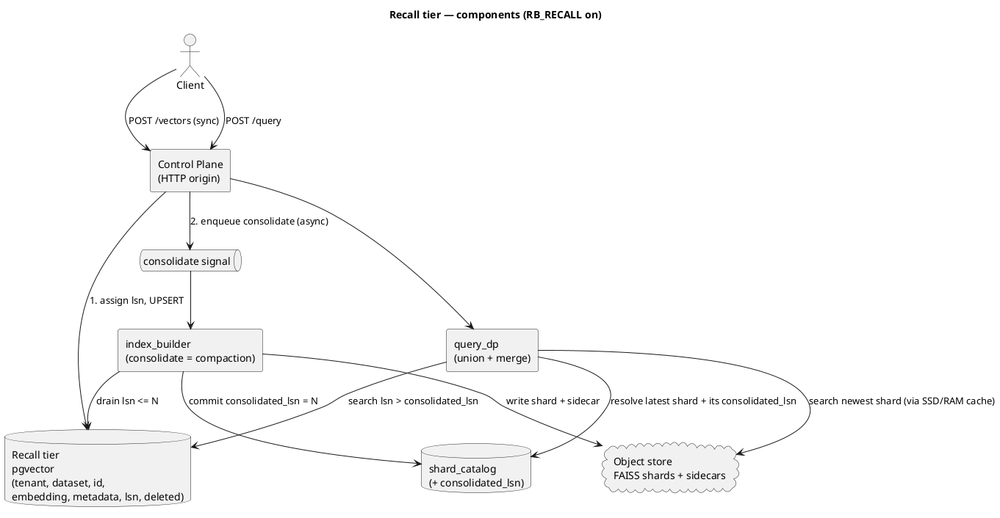
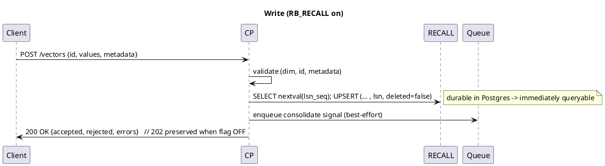
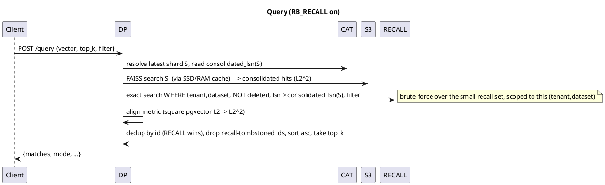

# Recall & Consolidate: read-your-writes on object storage

> **Status: DRAFT / not yet implemented.** Design under active iteration.
> The recall tier ships behind `RB_RECALL` (default **off**); a self-hoster who
> upgrades and changes nothing sees identical behaviour to today (same convention as
> [`ssd-cache.md`](ssd-cache.md)). Pairs with [`indexing.md`](indexing.md) (the build
> path consolidation reuses), [`ssd-cache.md`](ssd-cache.md) (the read-cache hierarchy this
> sits *beside*, not inside), and [`architecture.md`](architecture.md).

## The problem

RosalindDB today is **eventually consistent on writes**: `POST /v1/datasets/{name}/vectors`
returns `202`, lands NDJSON, and a `DATASET_READY` build folds it into a FAISS shard
asynchronously. A query issued between the write and the build completing does **not**
see the new vector — it returns `ephemeral` (empty + `job_id`) or hits an older shard.

For batch RAG over slowly-changing corpora that is fine. For **agent memory it is not**:
an agent that stores "the user is allergic to peanuts" and asks "what should I avoid?"
on the next turn must get the fact back *now*. That property — **read-your-writes** — is
the table stakes the async pipeline cannot provide.

The recall tier adds a small, synchronously-writable, immediately-queryable **recall tier**
in front of the immutable shards, and unions the two at query time. It is the classic
**LSM-tree** split (memtable + SSTables) applied to an object-storage vector index — the
same shape Turbopuffer (WAL + object storage) and Pinecone serverless (a "freshness
layer") use.

## Two axes — do not conflate them

RosalindDB will have two things that both get called "tiers." They are orthogonal:

| Axis | Members | Purpose | Authority | Affects correctness? |
|---|---|---|---|---|
| **Storage distance** (today, see `ssd-cache.md`) | Object store → SSD → RAM | make *reaching cold data* fast | disposable copies; S3 is truth | **No** — a miss is only slower |
| **Write freshness** (this doc) | **recall** ↔ **consolidated (shards)** | make *just-written data* visible | recall is authoritative until consolidated | **Yes** — the union must be complete |

The SSD/RAM cache (the storage-distance axis) holds **copies of consolidated shards**, and its
members are still called **hot/cold** there — that is the cache hit/miss distance, a *separate*
axis from this one. It can never lose data — a miss just re-fetches from S3. The recall tier
holds **data that is in no shard yet**. The only place completeness can break is the
**recall↔consolidated seam** (§The watermark, §Invariants) — never the cache.

## Architecture



The recall tier is **pgvector, deployed as a separate data-plane instance** (not the
control-plane Postgres — see §Blast radius). Consolidation is the **existing `index_builder`**
fed from pgvector rows instead of landing parquet. The watermark (`consolidated_lsn`) is the seam.

## Blast radius & control/data-plane isolation

The recall tier is **data-plane** work and MUST NOT share fate with the control-plane Postgres,
which is on the critical path of *every* query (the DP resolves tenant → dataset → latest
shard → `consolidated_lsn` from it). Today the vector *data* never touches the control-plane PG
(ingest goes S3 landing → builder → S3 shards); the recall tier must preserve that property.

Where the recall tier lives sets the blast radius of a write storm:

| Recall tier placement | A tenant write-storms → | Blast radius |
|---|---|---|
| Co-located on control-plane PG | metadata reads starve → no query can resolve its shard | **Total multi-tenant outage** |
| Separate shared recall instance (**default**) | co-tenants on that instance degrade; truth DB survives | degraded co-tenants, system up |
| Sharded / per-tenant recall (future) | only the noisy tenant degrades | noisy tenant only |

**Decision:** the recall tier defaults to a **separate pgvector instance** (data-plane),
addressed via `RB_RECALL_DSN`. This mirrors RosalindDB's existing control-plane/data-plane split
(the CP already proxies `/v1/query` to a private Query DP). Per-tenant load is bounded by
quotas + the recall-row cap + consolidation, and the design stays shardable so blast radius can
later shrink to per-tenant.

**The CP is protected by construction:** the LSN sequence lives in the recall store, so the
per-write path never touches the control-plane PG. The control-plane PG sees the recall tier only
as a low-frequency `consolidated_lsn` update at consolidation time — never per write.

## The watermark (the seam)

Every write is stamped with a monotonic **`lsn`** (log sequence number) from a per-dataset
sequence. Each `shard_catalog` row gains **`consolidated_lsn`** = the highest LSN folded into
that shard. This single number partitions the universe of vectors:

```
   lsn <= consolidated_lsn   ->  lives in CONSOLIDATED  (the shard)
   lsn >  consolidated_lsn   ->  lives in RECALL        (pgvector)
```

Every vector has exactly one LSN, so it is in **exactly one** set. Union = complete.
This is the whole correctness story; everything below protects this invariant.

The LSN sequence lives in the **recall store** (so the per-write path never touches the
control-plane PG); `consolidated_lsn` is written to the control-plane `shard_catalog` only at
consolidation. The two live in different databases by design (§Blast radius) — consolidation's
commit-then-trim ordering (I2) plus an **idempotent trim** make that split safe without a
distributed transaction.

> **New to LSN / LSM / SSTable?** See the reading list in the design journal
> (kept out of this repo). Short version: an LSN is a monotonic version stamp on each
> write (like a Postgres WAL LSN or a RocksDB sequence number); an LSM-tree buffers writes
> in an in-memory *memtable*, then flushes them to immutable on-disk *SSTables*, merged by
> *compaction*. Here: pgvector = memtable, S3 shards = SSTables, `index_builder` = compaction.

## Write path



**Consolidation-cadence change.** Today every ingest batch produces a new shard. With the
recall tier, **writes no longer create shards** — they accumulate in pgvector and are baked
into a shard on **consolidation**, which coalesces many writes into one build. Net effect vs
today:

| | Today | With recall tier |
|---|---|---|
| Shard created per | ingest batch | **consolidation** (batches many ingests) |
| Queryable when | after build | **immediately** (from recall) |
| Sidecar rewrites | per addition | per consolidation |

This *reduces* the write amplification `indexing.md` flags, and decouples shard-creation
rate from write rate.

**Delete / update.** Delete = `UPDATE … SET deleted=true` in recall (immediate tombstone).
Update = UPSERT (last-write-wins, new LSN). Tombstones are applied to the consolidated tier at
consolidation via the existing `_remove_ids`.

**Bulk imports bypass recall.** The async import path (`POST …/imports`) lands directly to
the consolidated tier (landing → builder → shard). Large dumps never enter the recall tier —
this is what keeps the recall set small enough for brute-force search (see §Recall search).

## Read path — the union



**Recall search = brute-force exact** (no ANN index), scoped to the `(tenant, dataset)`
partition via a b-tree filter, then exact L2 over those rows. Correct *by construction*
because consolidation keeps the partition small (§Recall search). HNSW is a flagged escape
hatch (`RB_RECALL_INDEX=hnsw`, default off), expected never to be needed.

**Metric alignment (correctness-critical):** the consolidated tier returns FAISS **L2-squared**;
pgvector `<->` returns plain L2. Square pgvector's distance before merging, over **identical
un-normalised** vectors, or the union ranks wrong. This is the most likely silent bug — it
gets a dedicated test. *Implemented* as `power(embedding <-> q, 2)` in the recall scan
(`adapters.state.state.recall_search`), so the recall `score` is L2² and merges directly with
the cold shard's FAISS L2² distances.

**Dedup:** a re-upserted id can be in both tiers during the consolidation grace window;
**recall wins** (its version is newer). Recall tombstones suppress matching consolidated ids.
The merge (`services.query_api.v1_query._merge_recall_and_cold`) keys on `id`: a recall **live**
row replaces the cold match for that id; a recall **tombstone** drops the cold match and
contributes nothing; the survivors are sorted ascending by L2² and truncated to `top_k`.

**No consolidated shard + recall has data → synchronous recall answer.** When the dataset has
no shard yet (`get_latest_shard` → none) the watermark is `0`, so every recall row qualifies and
the query is answered **synchronously from recall** — it does **not** fall through to the
`ephemeral` empty+`job_id` path (that path is reserved for "nothing can answer": no shard AND no
recall row). This is the read-your-writes property for a brand-new dataset.

**`mode` semantics under the union.** The response `mode` always reflects the **cold-shard cache
state**, never the recall contribution:

| Cold shard | Recall contributed | `mode` | `job_id`? |
|---|---|---|---|
| resolved (warm cache) | maybe | `hot` | no |
| resolved (cold load) | maybe | `cold` | no |
| none | yes | `recall` | no |
| none | no | `ephemeral` | yes |

So a `hot`/`cold` mode does **not** imply the recall tier was idle — recall may have overridden
or added matches; the label only describes the cold cache. `recall` is the dedicated value for
"no cold shard, recall answered." This is documented for callers in
[`docs/api/query.md`](../api/query.md).

**Watermark/shard pairing (I3) in code.** The cold search (`_hot_search`) reports the exact
shard row it resolved back to `run_query` (via an out-dict), and the recall scan is filtered with
*that* shard's `consolidated_lsn` — never a watermark resolved by an independent
`get_latest_shard` call — so a stale cached shard version can never open a partition gap.

## Invariants

These are named so tests and reviews can reference them.

- **I1 — Partition.** Every vector has exactly one `lsn`; the consolidated tier owns
  `lsn <= consolidated_lsn`, recall owns `lsn > consolidated_lsn`. ⇒ no vector is in *neither*
  tier.
- **I2 — Consolidation ordering.** Consolidation MUST: build shard → **commit**
  `consolidated_lsn=N` → **then** trim recall (`lsn <= N`). Never trim before commit. ⇒ no
  window where a row is in neither.
- **I3 — Watermark/shard pairing.** A query filters recall with
  `lsn > consolidated_lsn(**the shard it actually resolved/read**)`, not the catalog's claimed
  latest. ⇒ a stale cached shard version can never open a gap.
- **I4 — Grace buffer.** A consolidated recall row is physically deleted only once its covering
  shard is ≥ 2 generations old (symmetric to the `SHARD_KEEP=2` sweep). ⇒ an in-flight query
  that resolved an older shard still finds its rows in recall.

## Failure-mode table

| Scenario | Without protection | With invariants |
|---|---|---|
| Crash between shard commit and recall trim | rows in neither → lost reads | I2: rows still in recall (not yet trimmed) → served; trimmed next consolidation |
| Crash before shard commit | shard half-written | shard not committed; recall still authoritative; retried |
| Query reads stale cached shard V while V+1 exists | rows in (lsn_V, lsn_V+1] vanish | I3+I4: query uses V's watermark; those rows still in recall (grace buffer) |
| Re-upsert of an id present in the consolidated tier | duplicate in union | dedup recall-wins |
| Delete then immediate query | stale hit from consolidated tier | recall tombstone suppresses consolidated id |
| Chatty tenant outpaces consolidation | recall set grows unbounded → slow brute-force | per-tenant recall cap forces consolidation |

## Scale-to-zero preservation

An always-on pgvector in the recall path would quietly defeat scale-to-zero (idle tenants must
cost ~0). Mitigations, all **v1 requirements, not nice-to-haves**:

- **Consolidate-on-idle.** A `(tenant, dataset)` with no writes for `RB_RECALL_IDLE_CONSOLIDATE_S`
  is consolidated to completion → its recall row count → 0 → idle queries skip pgvector entirely
  (pure consolidated path / on-demand shard load). Postgres holds only the **active working set**.
- **Per-tenant recall cap** (`RB_RECALL_MAX_ROWS` per tenant/dataset) → forces a consolidation;
  bounds memory and keeps brute-force fast; stops one tenant evicting another's working set.
- **Bulk imports bypass recall** (above).

**Honest caveat (don't overclaim).** Read-your-writes requires *something* always-on to accept
synchronous writes, so the recall tier is a small, fixed, always-on **data-plane** cost
(Turbopuffer and Pinecone serverless have the same — their "freshness layers" are always-on
too). The **consolidated** tier scales to zero; the system as a whole does not go to literal
zero. A serverless scale-to-zero Postgres (e.g. Neon) as the recall store could reclaim even
that, at the price of cold-start latency on an idle tenant's first write — a future option, not
a v1 default.

## Recall search — why brute-force

The recall set is bounded by **consolidation cadence, not data size**. Total memory may be
millions of vectors (consolidated); recall holds only the trickle since the last consolidation —
hundreds to a few thousand rows. Exact L2 over that is sub-millisecond and has **zero recall
loss**; HNSW adds index-maintenance churn on a set that is about to be consolidated away. This
mirrors the existing codebase judgment in `query.md` ("the exhaustive scan is correct and fast
at current dataset sizes"), applied one tier up. Note `RB_RECALL_INDEX=hnsw` is not a drop-in
flag: the v1 `recall_vectors.embedding` column is an unparameterised `vector` (mixed per-dataset
dims), and a pgvector HNSW index requires a fixed dimension — so enabling it first needs a
fixed-dimension schema migration (e.g. a table/partition per embedding dimension).

## Config flags (all default off / current-behaviour-preserving)

| Flag | Default | Effect when set |
|---|---|---|
| `RB_RECALL` | `false` | Master switch: sync recall write, query union, consolidation worker |
| `RB_RECALL_MAX_ROWS` | `2000` | Per-(tenant,dataset) recall-row cap that forces a consolidation |
| `RB_RECALL_IDLE_CONSOLIDATE_S` | `60` | Idle window after which a dataset is consolidated to zero recall rows |
| `RB_RECALL_CONSOLIDATE_MAX_AGE_S` | `30` | Max age of the oldest recall row before a consolidation is forced |
| `RB_RECALL_INDEX` | `bruteforce` | `hnsw` to add a pgvector ANN index (escape hatch — requires a fixed-dimension schema migration first, since the v1 `recall_vectors.embedding` is an unparameterised `vector` for mixed per-dataset dims) |
| `RB_RECALL_DSN` | separate recall pgvector instance | DSN of the recall tier (data-plane), isolated from the control-plane PG by default. A single-tenant self-hoster MAY point it at the control-plane DSN to accept shared-fate. |

## TDD test plan

Unit (memory:// + a pgvector test instance; no S3 needed for merge logic):
- `test_lsn_monotonic_per_dataset`
- `test_union_merge_metric_alignment` — pgvector-L2 squared equals FAISS-L2² ordering
- `test_dedup_recall_wins_on_reupsert`
- `test_recall_tombstone_suppresses_consolidated_id`
- `test_recall_search_scoped_to_tenant_dataset`
- `test_query_skips_pgvector_when_recall_empty` (scale-to-zero path)

Integration (real PG/MinIO/Redis):
- `test_read_your_writes` — write → immediate query returns it
- `test_visibility_gap_during_consolidation` — query throughout a consolidation always returns the vector (I1/I2)
- `test_crash_between_commit_and_trim` — no loss, no dupe (I2)
- `test_stale_cache_version_uses_resolved_watermark` (I3)
- `test_grace_buffer_in_flight_older_shard` (I4)
- `test_consolidate_on_idle_drains_to_zero`
- `test_per_tenant_cap_forces_consolidation`
- `test_bulk_import_bypasses_recall`

## Decisions

**Decided**
- Recall tier = **pgvector**; consolidation reuses the existing `index_builder`.
- Recall search = **brute-force exact** (HNSW behind a flag).
- Feature-flagged, default-off, current-behaviour-preserving.
- LSN = **per-dataset** monotonic sequence, generated in the **recall store**; watermark =
  `shard_catalog.consolidated_lsn` (control-plane PG), written only at consolidation.
- **pgvector placement = separate data-plane instance by default** (`RB_RECALL_DSN`-overridable
  to the control-plane PG for single-tenant self-hosters). Rationale: blast-radius isolation
  of the control-plane truth DB (§Blast radius). The cross-DB watermark is made safe by I2
  (commit-then-trim) + an idempotent trim — no distributed transaction.
- **Ingest contract:** when `RB_RECALL` is on, `POST /vectors` returns **`200`** (write is
  synchronous, durable, immediately queryable); when off it keeps **`202`**. Body shape
  unchanged (`{accepted, rejected, errors}`, `job_id` optional). Flag-conditional, documented
  in `docs/api/v1.md`.
- **Sequencing (PR plan):** PR1 consolidated get/list/delete-by-id (flag-off correct) → PR2
  migrations + separate pgvector container → PR3 sync recall write + flag → PR4 query
  union/merge *(implemented — `recall_search` + `_merge_recall_and_cold`; see §Read path)* → PR5
  consolidation/compaction + consolidate-on-idle + caps → PR6 recall + consolidated union for
  get/list/delete + mem0 adapter + docs. Each flag-gated so `main` stays shippable.

**Open**
- (none blocking — ready to split into agents)

## Out of scope (future)
- HNSW recall index by default; W-TinyLFU-style recall eviction.
- Range/OR filters (v1 stays AND-of-equals, matching `query.md`).
- Append-structured sidecar (separate `indexing.md` follow-up).
- Multi-replica builder / shard-level locking (still single-replica).
